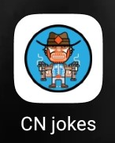

# CN jokes

## :page_facing_up: Overview

This is a cross-platform Flutter application. It works with [chucknorris.io API](https://api.chucknorris.io/). The app allows user to get jokes in three different ways. Jokes are fetched from the API. 

:joystick: APK can be downloaded from [here](https://drive.google.com/file/d/1deVbrcVeWSA1jQ-3Lij8NkxU_gjbfBAw/view?usp=sharing).

## :iphone: Functionality

App icon has the following view:

The app is operated with the navigation bottom bar.

The first is "Category" page. There are displayed all the categories present in the API. 
If user chooses one of these categories, the joke on this category will be displayed. After that user can either continue reading jokes in this category on go back.

&nbsp;  &nbsp; &nbsp; &nbsp; &nbsp; &nbsp; &nbsp; &nbsp; &nbsp;   &nbsp; &nbsp; &nbsp; &nbsp; &nbsp; &nbsp; &nbsp; &nbsp; &nbsp; &nbsp; &nbsp; 

Another is "Random" page. This page is for those, who cannot or do not want to chose any category. It shows a random joke in a random category.

&nbsp;  &nbsp; &nbsp; &nbsp; &nbsp; &nbsp; &nbsp; &nbsp; &nbsp; &nbsp; &nbsp; &nbsp; &nbsp; &nbsp; &nbsp; &nbsp; &nbsp; &nbsp; 

Finally, the third page is "Query". 

&nbsp;  &nbsp; &nbsp; &nbsp; &nbsp; &nbsp; &nbsp; &nbsp; &nbsp; &nbsp; &nbsp; &nbsp; &nbsp; &nbsp; &nbsp; &nbsp; &nbsp; &nbsp; 

It allows user to type some query and get the answer from the Chuck Norris API. It either shows the responce or the message about the absence of the responce.

&nbsp;  &nbsp; &nbsp; &nbsp; &nbsp; &nbsp; &nbsp; &nbsp; &nbsp;   &nbsp; &nbsp; &nbsp; &nbsp; &nbsp; &nbsp; &nbsp; &nbsp; &nbsp; &nbsp; &nbsp;  

Moreover, the app has an about dialog, it can be shown by tapping the button on the left top corner. It contains some info about the app and its author.

&nbsp;  &nbsp; &nbsp; &nbsp; &nbsp; &nbsp; &nbsp; &nbsp; &nbsp; &nbsp; &nbsp; &nbsp; &nbsp; &nbsp; &nbsp; &nbsp; &nbsp; &nbsp; 

## :mag_right: Demo

Here is a short demo which demoncstrates the functionality of the app.

&nbsp;  &nbsp; &nbsp; &nbsp; &nbsp; &nbsp; &nbsp; &nbsp; &nbsp; &nbsp; &nbsp; &nbsp; &nbsp; &nbsp; &nbsp; &nbsp; &nbsp; &nbsp; 
